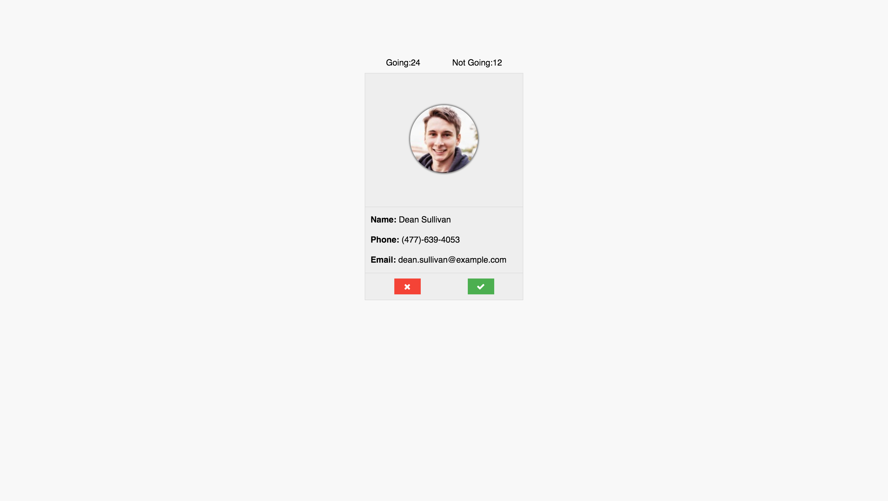

# Invite Full Stack

## Description
The goal is to create an evite type of program which will display 1 user at a time and then you can select yes or no on whether to invite them.  It will use the random person generator
[api](https://randomuser.me/) to display each person to show.

## Requirements

### Front End
* Layout the pages as shown in the screen shots below.  
* There will be 3 pages invite, going and notgoing.
* Invite Page
	* Use Ajax to call your express application and display 1 [random user](https://randomuser.me/) as someone to invite or not
	* Show the user buttons to accept or reject the user
	* Show the counts of those going and those not going as provided from the back end
	* When clicked the button should submit the random user's data to the back end via a post call
* Going/Not Going
	* Display all the users who are going or not going depending on the page
	* Layout as shown in the screenshot

#### Invite

#### Going

#### Not Going

### Back End
* Create a route for "/" that will return the invite data with the user counts for both going and not going.
* Create a route for "/going" that will pass all those going to the event.
* Create a route for "/notgoing" that will pass all those not going to the event.
* Create a POST route for "/mark-invitee"
	* Take the information POST about the user and store it in memory (i.e. in an array / object)
	* Don't forget to mark the user as going or not going